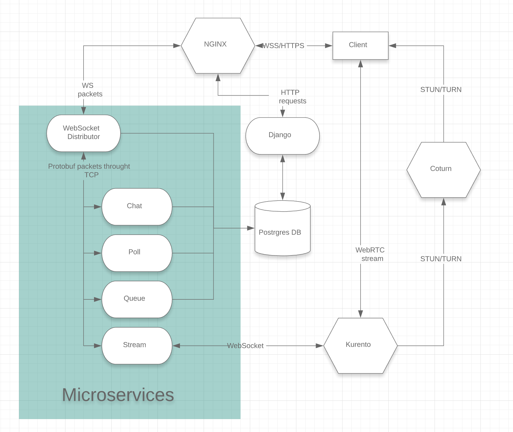

# Minute of fame

## English

Minute of Fame is a streaming service where all users watch the same stream. Everyone has the opportunity to join the queue. When it's your turn, a minute-long stream begins. If your stream gets more likes than dislikes, you are given another minute of time, otherwise next user starts stream.

Architecture: [Picture](README.md#Архитектура) 
Video: [Presentation](README.md#Презентация)

## Russian
Минута славы - это стриминговый сервис, в котором все пользователи смотрят один стрим. У каждого есть возможность встать в очередь. Когда подходит ваша очередь, начинается стрим длинной в минуту. Если ваш стрим набирает лайков больше, чем дизлайков, вам выдаётся ещё минута времени. На сайте есть страница Top. Там располагается топ-10 стримеров по количеству просмотров.

Ниже вы найдете более подробную информацию о проекте: презентацию, информацию о запуске, паттернах, архитектуре и разработчиках.

### Презентация

https://youtu.be/hHPdV-yy1Vg

### Запуск

Что бы запустить проект через docker-compose используйте следующие комманды

`docker network create -d bridge --subnet 192.168.0.0/24 --gateway 192.168.0.1 dockernet`

`docker-compose up --build`

Если вы не хотите каждый раз пересобирать контейнер, выполните следующие команды
1. Установите nodejs, npm и postgres
2. Запустите зависимые процессы через специальный docker-compose конфиг `docker-compose -f docker-compose.dev.yml up
 -d` (эта команда запустит контейнеры в фоне, так что если будете запускать основной проект через докер не забудте сначана выключить эти контейнеры)
3. Перейдите в директорию с js скриптами `cd ./app/js` и установите зависимости `npm install`
4. Вернитесь обратно `cd ../..` и создайте cache таблицу `python3 manage.py createcachetable`
5. Создайте миграции `python3 manage.py makemigrations` и примините их `python3 manage.py migrate`
6. Запустите сервер `run.dev.bat` если windows, если linux, то сначала сделайте скрипт запускаемым `chmod +x run.dev.sh` и теперь можете запускать `./run.dev.sh`

На linux сервер будет доступен на 8000 порте на windows на 80

Что бы применить нужные изменения теперь нужно будет только перезапусть скрипт `run.dev`

### Паттерны
Вся информация в файле Patterns.txt

### Архитектура
Эта картинка в файле Architecture.png

### Разработчики
**Ярослав Гончаров** a.k.a. **MapLegend** a.k.a. **AbsoluteLegend** 
  - Main Developer, Back End lead -  
Докер, система CI/CD, развёртывание на сервере, доведение до рабочего состояния трансляций, реализация очереди, разбивка на микросервисы, капча, юнит-тесты. 
 

**Горшенев Леонид** a.k.a. **Leodroid**
 - Team Lead - 
Конфигурация Django, фиксы страниц сайта и меню, создание страницы About. Фиксы кода клиентской части и работа с бд. Бекенд для модалов. Менеджмент git, решение конфликтов.

**Вероника Долгирева** a.k.a. **Nika**
 - Front End developer - 
Полная вёрстка страниц просмотра и редактирования профиля, работа над основной страницей и модалами, визуальная составляющая очереди, адаптация под мобильные устройства, кнопка старта стрима, плейсхолдер.
  

##### Back end
 

**Васильев Андрей** a.k.a. **Herr der Qual**
 - Back End developer - 
Cистемы логина и регистрации, настройка уведомлений, система трансляции и просмотра стрима, полная реализация чата.

**Шутов Никита** a.k.a. **Wigiglenekit**
 - Back End developer - 
Установка названия стрима и описания на страницу, реализация таймера, генерация очереди на странице, документация, улучшение кода для повышения безопасности.

**Степанов Николай** a.k.a. **KodKio**
 - Back End developer - 
Прототип чата, работа с регистрацией, работа с БД, чартами в профиле и топом.

**Кравцов Андрей** a.k.a. **KRAVTANDR**
 - Back End developer - 
Система лайков, прототип таймера.

**Бернов Андрей** a.k.a. **Sparkle**
 - Back End developer - 
Работа с профилем: редактирование, ссылки на страницы пользователей, pylint.
  

##### Front end
 

**Беликов Григорий** a.k.a. **Manndarinchik**
 - Front End lead - 
Базовый шаблон, вёрстка главной страницы, вёрстка страницы about, оформление чата, кнопки лайков/дизлайков, работа над визуальной частью чата, эмоджи. Монтаж видео презентации.

**Попова Маргарита** a.k.a. **Fortys1xand2**
 - Front End developer - 
Начало работы с RTCMulticonnection, капча, первый прототип очереди, подстановка ника стримера на страницу.

**Богдан Куликов** a.k.a. **Brem**
 - Front End developer - 
Работа с модалами (логин, регистрация, старт стрима).

**Кононов Артём** a.k.a. **Artem213101zse**
 - Front End developer - 
Система лайков, прототип таймера.

**Тимченко Даниил** a.k.a. **Danitim**
 - Front End developer - 
Первый прототип визуала очереди, небольшие фронтенд фиксы.
