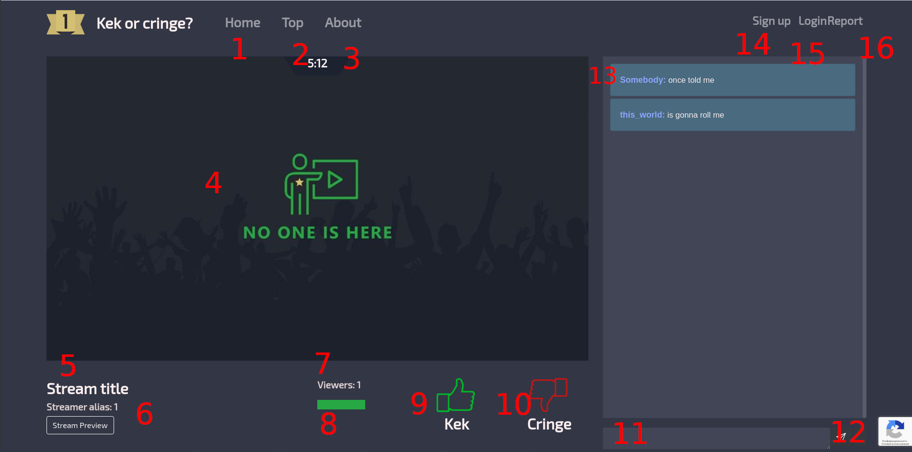
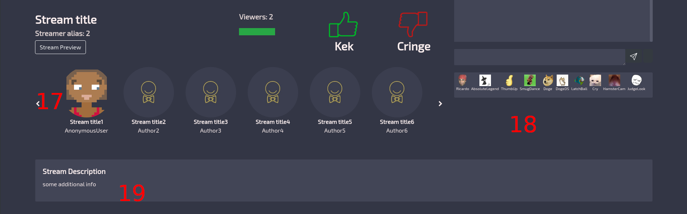

 
=====================
Пользовательский гайд
=====================

Концепция
---------
Основная идея пректа очень проста

Есть стримеры и зрители

Стримеры в течении 40 секунд должны заинтересовать зрителей

Если Kek > 50%, данному стримеру дается еще 40 секунд,

если cringe > 50%, то текущий стример сменяется следующим в очереди

Какой браузер лучше использовать?
---------------------------------
Для избежания разнообразных проблем , мы рекомендуем использовать google chrome

Основные элементы управления
----------------------------

#. Главаня страница
#. Рейтинг стримеров по общему поличество просмотров
#. О проекте
#. Окно стрима
#. Название стрима
#. Имя стримера
#. Общее количество просмотров
#. Процентное соотношение лайков и дизлайков
#. Положительно оценить стрим (Kek)
#. Отрицательно оценить стрим (Cringe)
#. Поле ввода для чата
#. Кнопка отпрвить
#. Сообщения в чате
#. Кнопка регистрации
#. Кнопка входа
#. Послать жалобу на этот стрим
#. Очередь стримеров
#. Эмоджи которые можно отправить в чат!
#. дополнительная информация о стриме

$

Примеры использования эмоджи
-----------------------------

Что бы отправить эмоджи, нужно в поле ввода написать (или скопировать из примеров) их названия 

Названия обязательно должны быть разделены одним пробелом с каждой стороны!

Названия чувствительны к регистру!

Примеры неправильного использования::

    Absolutelegend
    
    absoluteLegend
    
    я ЛюблюRicardoRicardo!
    
Примеры правильного использования::

   AbsoluteLegend
   
   я Люблю Ricardo Ricardo !

   
